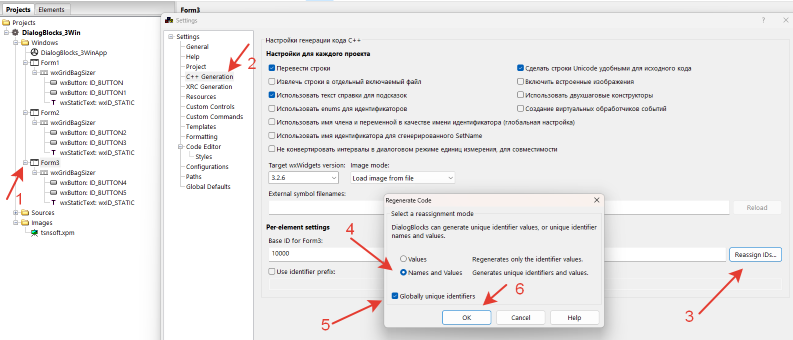

# DialogBlocks_3Win
Пример трехоконной программы на C++ с использованием wxWidgets в DialogBlocks


Нужно сделать чтобы ID всех окон и элементов были разные во всех окнах, иначе не будет работать!



## Основные обработчики

**Form1**

```
void Form1::OnButtonClickExit(wxCommandEvent& event)
{
    wxTheApp->Exit(); // Или Destroy();
}

void Form1::OnButton1ClickNext(wxCommandEvent& event)
{
    Form2* window = new Form2(this);
    if (window) {
        window->Show(true);
        Hide();
    }
}

void Form1::OnCloseWindow(wxCloseEvent& event)
{
    wxTheApp->Exit(); // Или Destroy();
}
```

**Form2**

```
void Form2::OnCloseWindow(wxCloseEvent& event)
{
    wxWindow* parent = GetParent();
    Destroy();
    if (parent && !parent->IsBeingDeleted()) {
        parent->Show(true);
    }
}

void Form2::OnButton2ClickPrior(wxCommandEvent& event)
{
    wxWindow* parent = GetParent();
    Destroy();
    if (parent && !parent->IsBeingDeleted()) {
        parent->Show(true);
    }
}

void Form2::OnButton3ClickNext(wxCommandEvent& event)
{
    Form3* window = new Form3(this);
    if (window) {
        window->Show(true);
        Hide();
    }
}
```

**Form3**

```
void Form3::OnCloseWindow(wxCloseEvent& event)
{
    wxWindow* parent = GetParent();
    Destroy();
    if (parent && !parent->IsBeingDeleted()) {
        parent->Show(true);
    }
}

void Form3::OnButton4ClickPrior(wxCommandEvent& event)
{
    wxWindow* parent = GetParent();
    Destroy();
    if (parent && !parent->IsBeingDeleted()) {
        parent->Show(true);
    }
}

void Form3::OnButton5ClickExit(wxCommandEvent& event)
{
    wxTheApp->Exit();
}
```

## Ссылки:

http://www.anthemion.co.uk/dialogblocks/

https://www.wxwidgets.org/

https://visualstudio.microsoft.com/ru/vs/community/

http://www.anthemion.co.uk/dialogblocks/ImageBlocks-1.07-Setup.exe
